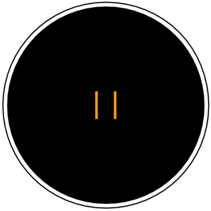

#### [PT-BR]

# Greyjoy
Um robô autônomo criado para competir em batalhas sumô nas categorias leve ou pesada.

# História
O Greyjoy foi desenvolvido em 2013 dentro da Universidade Federal do Pará, por uma equipe do curso de Engenharia da Computação, na disciplina Projetos de Engenharia III, ministrada pelo Prof. Dr. Marco J. Sousa. Os integrantes eram:

- José Soares, Luan Gonçalves, Luiz Henrique, Mylena Reis e Wederson Silva

Participou do torneio da disciplina, no mesmo ano participou da Semana do Instituto de Tecnologia (Sitec) da UFPA. Desde então participou de torneios, exposições e palestras e foi mantido por integrantes da equipe original até o ano de 2019, quando foi doado ao Laboratório de Prototipagem, Robótica e Otimização (LabPro) onde permanece até hoje.

# Batalha Sumô
Em resumo, dois robôs de mesma categoria são posicionados na arena, e então a batalha começa. O primeirorobô que empurrar o adversário para fora da arena, será o vencedor!

Uma arena de batalha sumô, na maioria das vezes, tem o formato da imagem abaixo:

[Aqui](docs/regras_sumo_robo-LabPro2018.pdf) tem um exemplo de regulamento completo para uma competição de batalha sumô robô [pt-br].

# Características do Greyjoy
Este robô possui um chassi feito de acrílico, usa rodas de aeromodelo, tem dois servo motores modificados (180º transformado em 360º), um sensor ultrassônico HC-SR e um microcontrolador Arduíno.

### ATENÇÃO!!!!
A versão do código está sendo testada.
