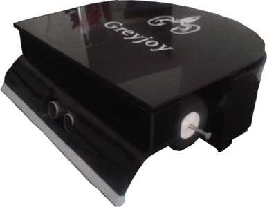
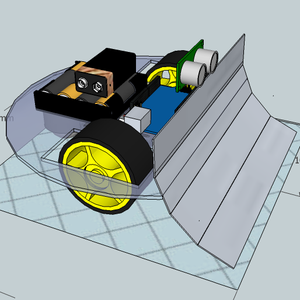

#### [PT-BR]

# Greyjoy
Um robô autônomo criado para competir em batalhas sumô nas categorias leve ou pesada.

## História
O Greyjoy foi desenvolvido em 2013 dentro da Universidade Federal do Pará (UFPA), por uma equipe do curso de Engenharia da Computação, na disciplina Projetos de Engenharia III, ministrada pelo Prof. Dr. Marco J. Sousa. Os integrantes eram:

- José Soares, Luan Gonçalves, Luiz Henrique, Mylena Reis e Wederson Silva

Este robô participou do torneio da disciplina e no mesmo ano participou da Semana do Instituto de Tecnologia (Sitec) da UFPA. A partir daí esteve em torneios, exposições e palestras, sendo mantido por integrantes da equipe original até o ano de 2019, quando foi doado ao Laboratório de Prototipagem, Robótica e Otimização (LabPro), onde permanece até hoje.

## Batalha Sumô
Em resumo, dois robôs de mesma categoria são posicionados em uma arena e então a batalha começa. O primeiro robô que empurrar o adversário para fora da arena, será o vencedor!

Uma arena de batalha sumô, na maioria das vezes, tem o formato da imagem abaixo:

[Aqui](docs/regras_sumo_robo-LabPro2018.pdf) você encontra um exemplo de regulamento completo para uma competição de batalha sumô robô [pt-br].

## Características do Greyjoy
A figura abaixo ilustra a nossa ideia inicial acerca do design.

Em sua versão final: 

* O chassi é de acrílico
* Usa 2 rodas de aeromodelo (isopor revestido)
* 2 servo motores modificados (180º transformado em 360º)
* 1 sensor ultrassônico HC-SR 
* 1 microcontrolador Arduíno

## Algoritmo

Assim que o robô é ligado, ele espera 5 segundos (de acordo com as regras da batalha) e então começa a procurar por um adversário realizando movimentos direcionais aleatórios. Se ele encontra um adversário segue em direção ao alvo, caso encontre a linha branca que indica a borda da arena, Greyjoy dá ré por 2 segundos aproximadamente e continua a sua procura.

### ATENÇÃO!!!!
A versão do código está sendo testada.
